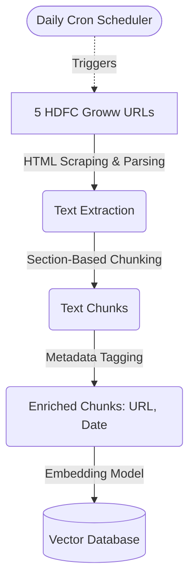
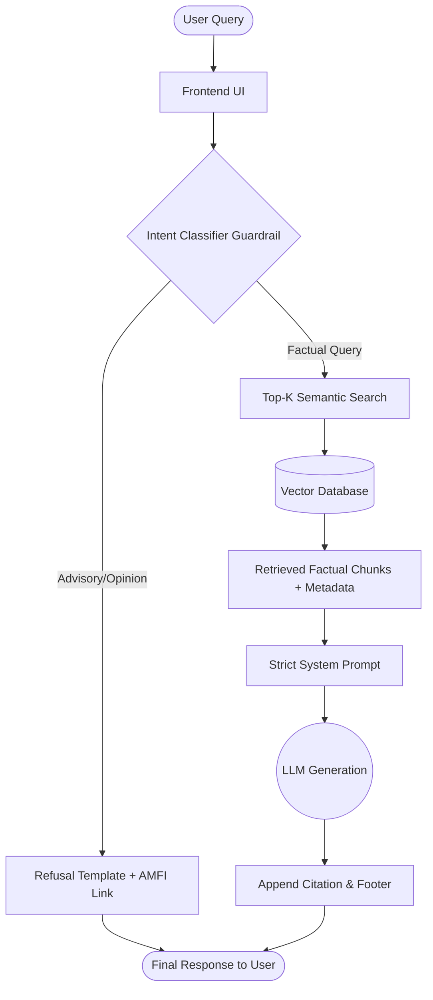

# Architecture Document: Mutual Fund FAQ Assistant

## 1. System Overview
The Mutual Fund FAQ Assistant employs a **Retrieval-Augmented Generation (RAG)** architecture. It is designed to act as a strict, facts-only system that avoids generative hallucinations and advisory responses. The pipeline focuses heavily on accurate retrieval and strictly constrained LLM generation.

## 2. Core Components

### 2.1 Data Ingestion & Processing Pipeline
- **Corpus Sources**: Strictly the 5 provided HDFC Mutual Fund Groww URLs. No external PDFs or other official documents are used.
- **Web Scraping**: HTML extractors (e.g., BeautifulSoup or Puppeteer) for parsing the web pages.
- **Chunking Strategy**: Semantic or section-based chunking. Since mutual fund data is highly structured (e.g., tables containing expense ratios or exit loads), the chunking strategy must preserve contextual boundaries to avoid losing metric-to-value associations.
- **Metadata Tagging**: Every text chunk is enriched with essential metadata: `source_url`, `fund_name`, and `last_updated_date`. This is critical for the required single-citation response.

### 2.2 Embedding & Vector Storage
- **Embedding Model**: The **BGE model** (e.g., `BAAI/bge-large-en` or similar) is used as a highly capable open-source embedding model to convert textual chunks into vector representations.
- **Vector Database**: A lightweight or managed vector store (e.g., ChromaDB, FAISS, or Pinecone) to securely store and efficiently query the embedded chunks and their metadata.

### 2.3 Query Processing & Guardrails (Pre-Retrieval)
Before a query hits the retrieval layer, it passes through a strict guardrail system:
- **Intent Classifier / Router**: A lightweight classification model or zero-shot prompt determines if the query is **Factual** (e.g., "What is the exit load?") or **Advisory/Opinionated** (e.g., "Should I invest?").
- **Refusal Handler**: If the query is flagged as advisory, the system immediately short-circuits the pipeline and returns a polite refusal template, reinforcing the facts-only limitation and providing an AMFI/SEBI educational link.

### 2.4 Retrieval & Generation (RAG Core)
- **Top-K Semantic Search**: For factual queries, the system retrieves the most relevant chunks from the Vector Database.
- **Prompt Engineering**: The LLM is provided with a strict system prompt that enforces the constraints:
  - Base the answer *only* on the retrieved context.
  - Keep the answer to a maximum of 3 sentences.
  - Return the exact metadata URL as the citation.
- **Generation Model**: The **Groq** inference engine is utilized for ultra-fast generation (powering an LLM like Llama 3 via Groq). It is configured with a low temperature (`0.0` or `0.1`) to ensure deterministic, factual outputs.

### 2.5 Presentation Layer (UI)
- **Frontend interface**: A clean, minimal UI built using lightweight web technologies (e.g., React, Streamlit, or plain HTML/JS).
- **Static Elements**: Displays a welcome message, 3 clickable example queries, and a persistent, highly visible disclaimer: `"Facts-only. No investment advice."`
- **Response Formatting**: Appends the mandatory footer to every LLM response: `Last updated from sources: <date>`.

### 2.6 Automated Data Scheduler (Ingestion Trigger)
To ensure the LLM always answers using the freshest Mutual Fund data (like updated daily NAVs), a background scheduler runs on a daily cadence.
- **Trigger**: A cron job or background scheduling tool that fires once every 24 hours.
- **Pipeline Execution**: Upon triggering, it automatically runs the Data Ingestion pipeline (`scraper.py` → `parse_data.py` → `build_index.py`).
- **Data Refresh**: It overwrites the Chroma Vector Database with newly embedded chunks so that the assistant always pulls the most recent numbers without manual intervention.

## 3. Request Flow Diagram
The following diagram illustrates the strict guardrails and RAG generation pipeline for handling user queries.

1. **User Input** → Query is entered into the UI.
2. **Guardrail Check** → Is the query advisory? 
   - *Yes* → Return Refusal Template + SEBI/AMFI link.
   - *No* → Proceed to Retrieval.
3. **Retrieval** → Vector DB returns Top-K factual chunks + metadata.
4. **Generation** → LLM constructs a <= 3 sentence answer using ONLY the retrieved chunks.
5. **Post-Processing** → System appends the citation link and "Last updated" footer.
6. **Output** → Final response displayed to the user.

## 4. Security, Privacy & Constraints
- **Stateless Architecture**: The system does not require user authentication.
- **Zero PII Storage**: The application will actively drop/ignore any PII (PAN, Aadhaar, account numbers, OTPs, emails, phone numbers) provided in the query.
- **Compliance**: The architecture guarantees zero advisory capabilities, adhering strictly to SEBI guidelines regarding investment advice.
